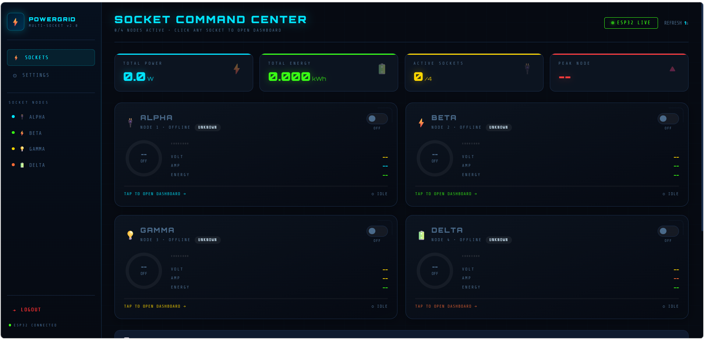
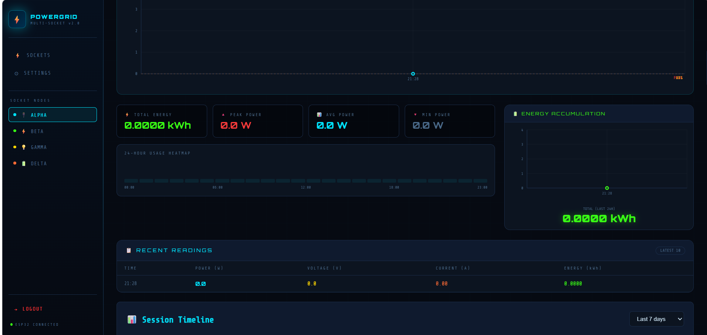
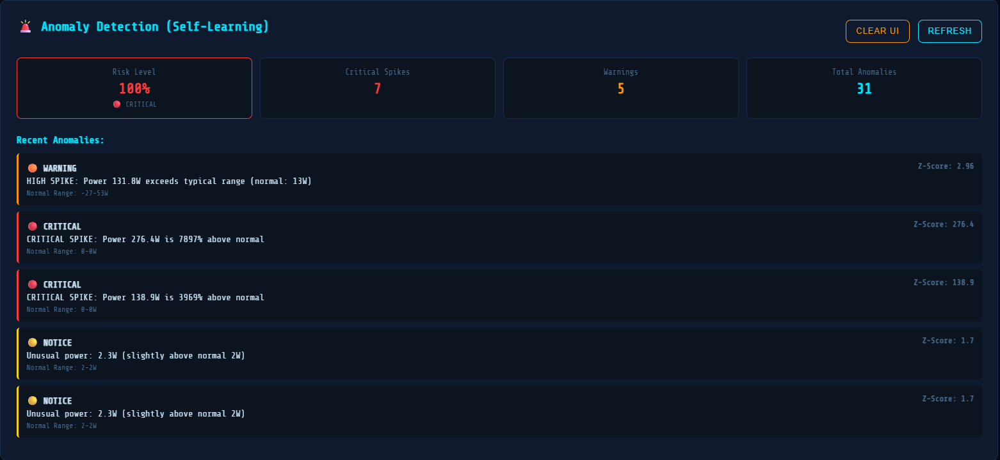

# ⚡ EnergyMeter

Smart IoT energy monitoring platform using ESP32, React, Node.js, Firebase, and ML-based anomaly detection.

---

# 🚀 Features

- Real-time energy monitoring dashboard
- Historical analytics and visualization
- ML-based anomaly detection using Isolation Forest
- AI-powered energy optimization recommendations
- Power quality monitoring
- Multi-socket monitoring support
- JWT authentication system
- Firebase cloud integration
- Offline/no-data handling

---

# 🛠️ Tech Stack

## Frontend
- React.js
- Axios
- CSS

## Backend
- Node.js
- Express.js
- Firebase
- JWT Authentication

## ML Service
- Python Flask
- scikit-learn
- Isolation Forest

## Hardware
- ESP32

---

# 📊 System Architecture

ESP32 Sensors → Node.js Backend → Firebase → Python ML Service → React Dashboard

---

# 📸 Screenshots

## Dashboard


## Analytics


## Anomaly Detection


---

# ⚙️ Installation

## Clone Repository

```bash
git clone https://github.com/gaganpraj7-wq/EnergyMeter.git
```

---

## Frontend Setup

```bash
cd frontend
npm install
npm start
```

---

## Backend Setup

```bash
cd backend
npm install
npm run dev
```

---

## ML Service Setup

```bash
cd ml-service
pip install -r requirements.txt
python app.py
```

---

# 🎯 Purpose

This project was built to combine IoT, cloud services, machine learning, and full-stack engineering into a scalable real-time energy monitoring platform.

---

# 🔮 Future Improvements

- Mobile app integration
- Predictive energy forecasting
- Smart automation controls
- Real-time notifications
- Advanced device analytics
